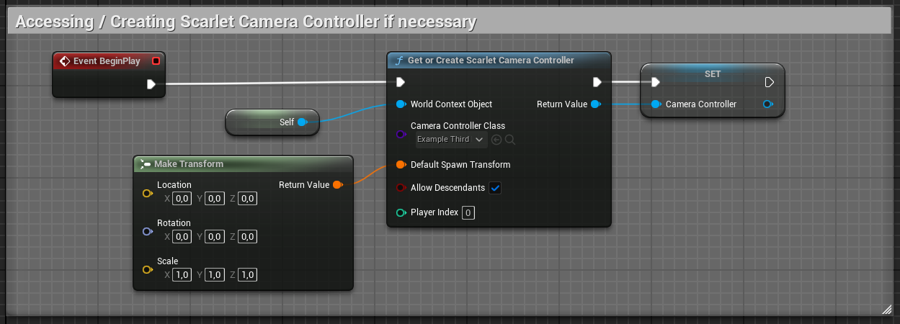
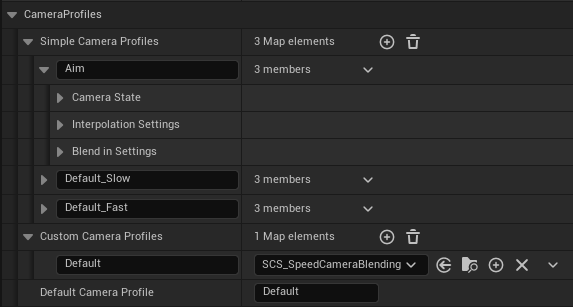
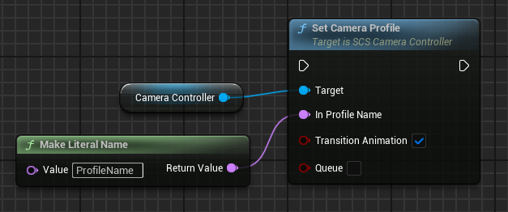
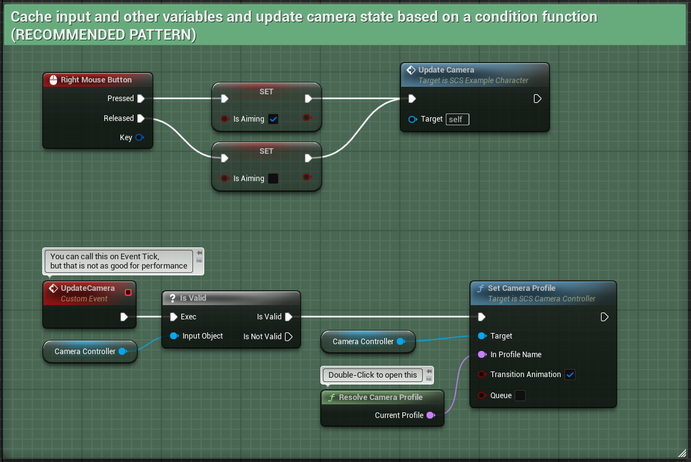
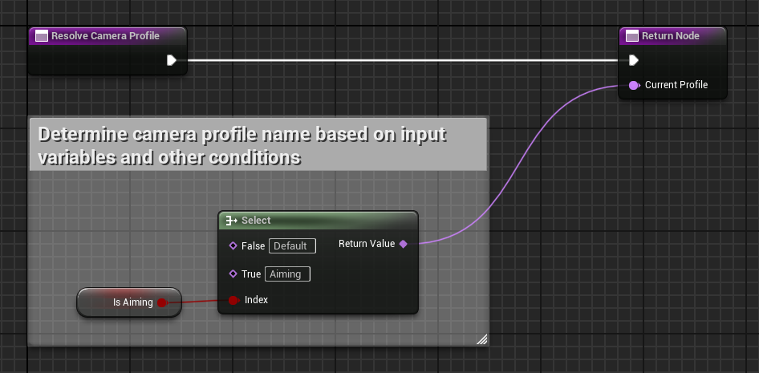
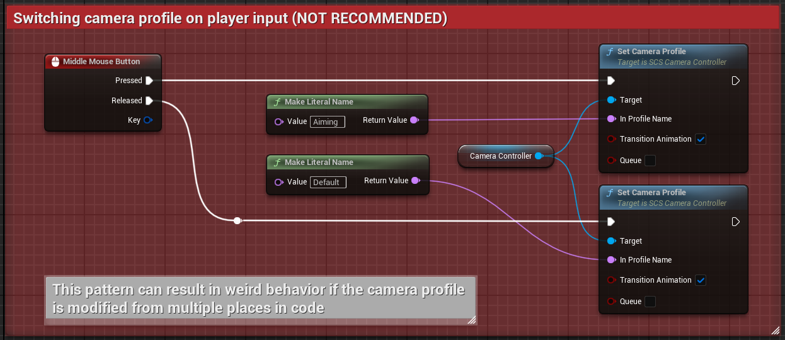
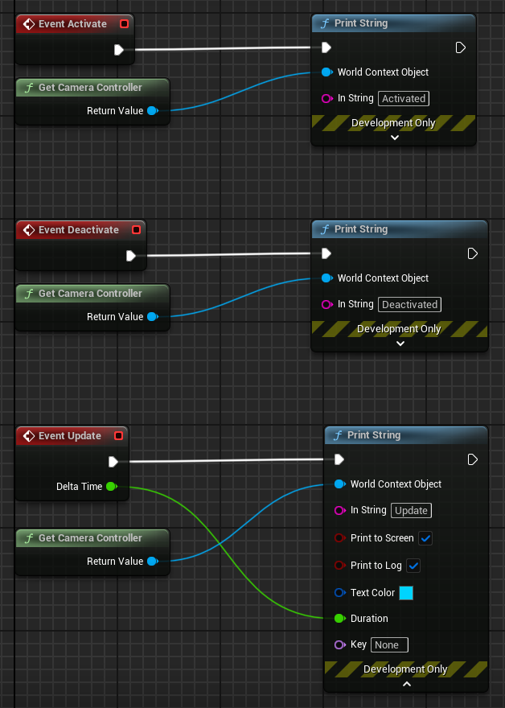

# Usage Guide

### Setup

**1.** Create a blueprint class, derived from `ScarletCameraControllerBP` - this class will contain your camera configuration. This class will be further referred to as `MyController`.

**2.** In your player character/pawn class use a `GetOrCreateScarletCameraController` to access or create, if necessary, a camera controller. Specify `MyController` as the controller class:

**3.** Make sure your character mesh and capsule do not block Camera trace channel, otherwise camera collision will not work properly.

---
### Adding Profiles

Scarlet Camera System provides 2 general kinds of camera profiles: *Simple* and *Custom*.

*Custom* profiles require you to create a class, derived from `SCS_CameraProfile`, while *Simple* profiles let you specify there configuration directly in `MyController`'s parameters.

Profiles can be defined in *Class Defaults* section in `MyController` blueprint class:

**IMPORTANT: Profile name spaces are shared! Simple profile names MUST not overlap with Custom profile names!**

`DefaultCameraProfile` parameter determines which profile will be active on begin-play.

---
### Switching Between Profiles

You can switch between camera profiles using `SetCameraProfile`:

* `TransitionAnimation` determines whether the transition animation is played or not.
* `Queue` - this flag enables queueing of profile switch requests, if set to true, profile switch requests will play one after the other. Queue transitions are interrupted if  `SetCameraProfile` is called without the `Queue` flag.

For switching between camera profiles based on player input the following pattern is recommended:

Pattern below is NOT recommended:

---
### Profile Configuration

#### Camera State

- `FieldOfView` - camera's field of view;
- `BoomArmLength` - length of the camera arm, that originates in camera controller's location.
- `CameraOffset` - offset of the camera socket at the end of the camera arm; 
- `DoCollisionTest` - whether the camera arm is required to perform collision tests;

- `CameraLocation` - defines location of the camera controller:
	- `LocationType` - defines the way location is resolved: 
		- *Player Attachment* - camera controller is attached to the player's pawn actor;
		- *Actor Attachment* - camera controller is attached to an arbitrary actor, defined by `AttachmentActor`;
		- `World` - camera controller is placed stationary in the world.
	- `AttachmentActor` - acts as an attachment point, when *Actor Attachment* location type is used.
	- `Location` - location/offset of the camera controller in the space, determined by Location Type.

- `CameraArmRotation` - defines rotation of the camera arm (camera controller):
	- `RotationType` - defines the way rotation is resolved:
		* *Player Attachment* - camera arm is attached to the player's pawn actor;
		- *Actor Attachment* - camera arm is attached to an arbitrary actor, defined by `AttachmentActor`;
		- `World` - camera arm is placed stationary in the world.
	- `AttachmentActor` - acts as an attachment point, when *Actor Attachment* rotation type is used.
	- `Rotation` - rotation/offset of the camera arm in space, determined by Rotation Type.

- `EnableSeparateCameraRotation` - whether to allow camera to rotate independently from the camera arm. If set to true, `SeparateCameraRotation` will be used for camera rotation.
- `SeparateCameraRotation` - camera rotation that is independent from the camera arm:
	- `RotationType` - defines the way rotation is resolved:
		* *Player Attachment* - camera is attached to the player's pawn actor;
		- *Actor Attachment* - camera is attached to an arbitrary actor, defined by `AttachmentActor`;
		- `World` - camera is placed stationary in the world.
	- `AttachmentActor` - acts as an attachment point, when *Actor Attachment* rotation type is used.
	- `Rotation` - rotation/offset of the camera in space, determined by Rotation Type.

#### Camera State Interpolation

The following parameters determine how camera state's parameters are interpolated (smoothed) over time. Every parameter (that required interpolation) has a corresponding interpolation type and interpolation speed value:

- `FieldOfView_InterpolationType`
- `FieldOfView_InterpolationSpeed`

- `BoomArmLength_InterpolationType`
- `BoomArmLength_InterpolationSpeed`

- `CameraOffset_InterpolationType`
- `CameraOffset_InterpolationSpeed`

- `Location_InterpolationType`
- `Location_InterpolationSpeed`

- `Rotation_InterpolationType`
- `Rotation_InterpolationSpeed`

- `SeparateCameraRotation_InterpolationType`
- `SeparateCameraRotation_InterpolationSpeed`

Scarlet camera system implements the following types of interpolation:
* *None* - instant transition, no interpolation is used;
* *Linear* - values are interpolated with a constant speed;
* *Ease* - classic ease-in-out interpolation (default).

#### Blend In Settings

Blend In settings define transition animation parameters when switching to this profile (profile that owns this blend in settings).

* `TransitionAnimationDuration` - determines how long the transition animation is (in seconds).

For every camera state parameter, that required interpolation, a transition curve can be specified:
- `FieldOfView_Curve`
- `BoomArmLength_Curve`
- `Location_Curve`
- `Rotation_Curve`
- `SeparateCameraRotation_Curve`

*NOTE: Ease-In-Out interpolation is used if not curve is provided.*

---
### Creating Custom Profiles

To create a custom profile you need to create a class (blueprint or C++), derived from `USCS_CameraProfile` and override the following methods:
* `GetCameraState()`
* `GetCameraStateInterpolation()`
* `GetBlendInSettings()`

These methods can (and should) define dynamic values for corresponding values.

Additionally you can override `Activate`, `Deactivate` and `Update` methods:

* `Activate` is called when this profile is switched to (the moment transition animation starts or `SetCameraProfile` is called).
* `Deactivate` is called right before a new profile is activated.
* `Update` is called every tick when this profile is active (used as current camera profile).