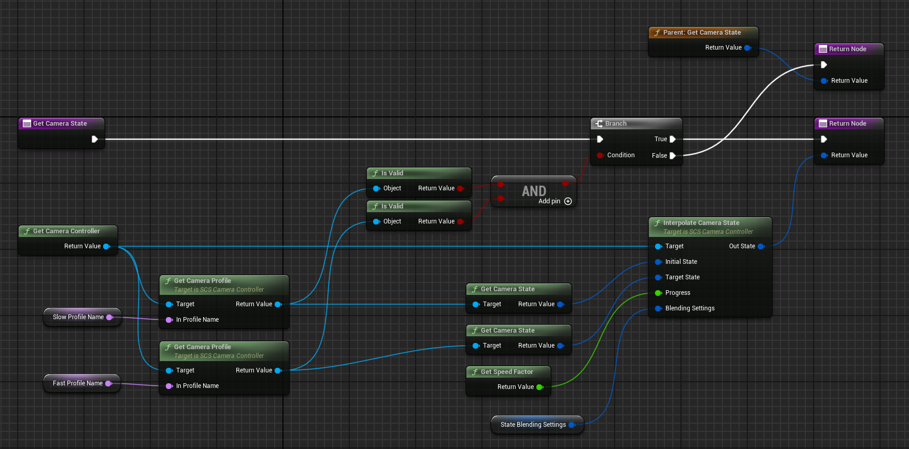
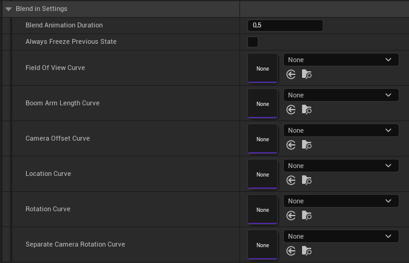
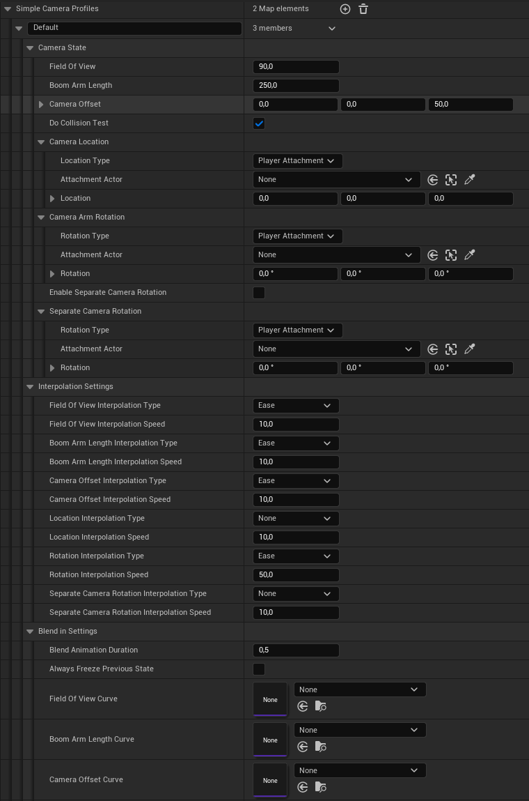

# Scarlet Camera System

An Unreal Engine 5.4 plugin, providing a dynamic & modular camera control system.

**Status: Early Access / In Development**

---
### Features

#### Dynamic Camera Profiles

The profile below changes it's characteristics based on how fast the camera is moving!

By creating custom camera profiles you can easily define dynamic camera behavior, which can be as complex as you want it to be! 

*For example the profile above uses camera speed to blend between parameters of OTHER camera profiles.*

#### Profile Transition Animation

Switching between camera profiles is handled with a customizable transition animation!

*NOTE: Ease-In-Out interpolation is used whenever you leave curves unspecified.*

#### "Simple" Camera Profile Customization

In addition to class-defined custom camera profiles, this system provides Simple Camera Profiles, that can be easily customized using the following set of parameters:

*Simple profiles can be used for many purposes, including providing configuration for custom profiles, that blend blend between parameters of OTHER camera profiles, as shown in the example above.*

---
### Installation

1. Download the latest release;
2. Extract the archive and move plugin folder to the `./Plugins` directory in your project (if your project has no `./Plugin` directory, then create it).

---
### User Guide

*TO DO: Add a user guide*

---
### Documentation

